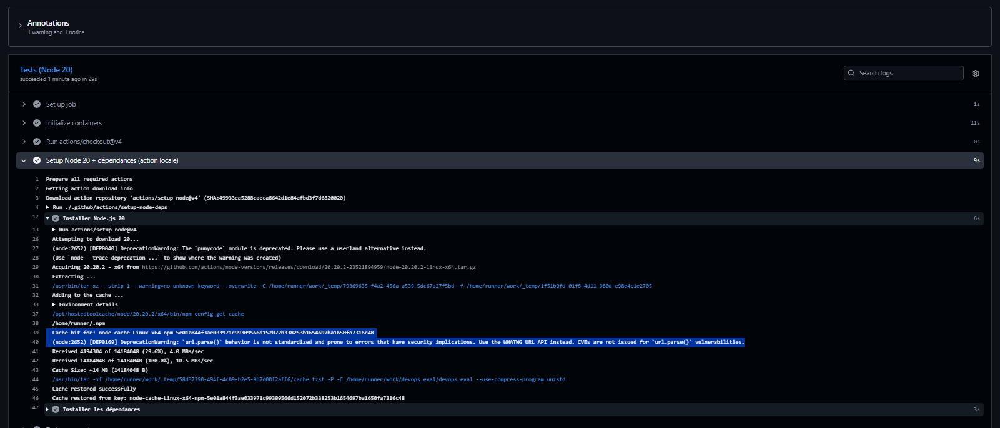

# Étapes du projet

Notes de suivi : ce qui a été fait à chaque étape, et les commandes pour le tester soi-même.
Les commandes sont pour Linux (la VM Debian). Il faut Node 20 ou 22 et Docker.

Avancement :

- [x] 1. Application (API + Postgres)
- [x] 2. Test automatisé
- [x] 3. Dockerfile
- [x] 4. docker-compose
- [x] 5. Action locale réutilisable
- [x] 6. CI (ci.yml)
- [x] 7. CD (cd.yml) + déploiement sur la VM
- [x] 8. Métriques /metrics + alertes
- [ ] 9. README, zip, collaborateur

---

## Préparation (à faire une fois)

Pour les étapes 1 à 3, on a juste besoin de la base Postgres. On lance seulement le service `db` du docker-compose :

```bash
docker compose up -d db
```

La base est accessible sur `localhost:5432` (user `app`, mot de passe `app`, base `app`).

Puis on installe les dépendances du projet :

```bash
npm ci
```

Pour tout arrêter à la fin : `docker compose down` (ajouter `-v` pour effacer aussi les données)

---

## Étape 1 : l'application

Une petite API de notes en Node.js (Express 5) qui stocke les données dans Postgres.

Fichiers :

- `src/db.js` : connexion à Postgres, config lue dans les variables d'environnement (DB_HOST, DB_USER, DB_PASSWORD, DB_NAME), création de la table `notes`
- `src/app.js` : les routes
- `src/server.js` : démarre le serveur sur le port 3000

Routes :

| Route | Ce qu'elle fait |
|---|---|
| GET /health | fait un `SELECT 1` sur la base. 200 si ça répond, 503 sinon |
| POST /notes | crée une note (`{"text": "..."}`). 201, ou 400 si le texte est vide |
| GET /notes | liste les notes |

Pourquoi `/health` interroge la base : si l'API tourne mais que la base est morte, l'appli ne sert à rien. Un health qui répond toujours "ok" ne voudrait rien dire.

Pourquoi app.js et server.js sont séparés : le test importe `app.js` directement, sans avoir à lancer le serveur.

### Tester

Lancer l'API (dans un premier terminal) :

```bash
npm start
```

Dans un deuxième terminal :

```bash
# santé -> 200
curl -i http://localhost:3000/health

# créer une note -> 201
curl -i -X POST http://localhost:3000/notes \
  -H 'Content-Type: application/json' -d '{"text":"ma premiere note"}'

# note vide -> 400
curl -i -X POST http://localhost:3000/notes \
  -H 'Content-Type: application/json' -d '{"text":""}'

# lister -> 200 avec la note
curl http://localhost:3000/notes
```

### Prouver que le health est honnête

```bash
docker compose stop db
curl -i http://localhost:3000/health     # -> 503, {"status":"error","db":"down"}

docker compose start db
sleep 3
curl -i http://localhost:3000/health     # -> 200 de nouveau
```

L'API ne doit pas planter pendant la coupure. Au début elle plantait : la librairie `pg` lève une erreur quand la base ferme une connexion, et sans `pool.on('error', ...)` Node s'arrêtait. C'est corrigé dans `db.js`.

---

## Étape 2 : le test automatisé

Fichier : `tests/api.test.js`. Outils : jest (lance le test) et supertest (envoie des requêtes HTTP à l'app).

Le sujet demande au moins un test qui vérifie un vrai comportement. Il y en a un, et il coche les 3 exemples donnés dans le sujet :

| Ce que demande le sujet | Dans le test |
|---|---|
| code de retour HTTP | `expect(res.status).toBe(201)` |
| contenu de réponse | `expect(res.body.text).toBe('acheter du pain')` |
| interaction avec un service | `SELECT` direct dans Postgres pour vérifier que la note est bien enregistrée |

C'est un test d'intégration : il utilise une vraie base Postgres (en local celle du compose, en CI le `services: postgres`). La table est vidée au début (`TRUNCATE`) pour que le test donne toujours le même résultat.

### Tester

Postgres doit tourner (voir Préparation). Pas besoin de lancer l'API.

```bash
npm test
```

Résultat attendu : `Tests: 1 passed, 1 total` et un tableau de couverture.

Les rapports sont générés dans `reports/` :

- `reports/junit.xml` : résultat du test au format JUnit
- `reports/coverage/` : couverture de code (ouvrir `reports/coverage/lcov-report/index.html` dans un navigateur)

La CI les publie en artifacts.

### Prouver que le test teste vraiment quelque chose

```bash
docker compose stop db
npm test          # -> le test échoue
docker compose start db
```

Autre façon : casser le code et voir le test échouer.

```bash
sed -i 's/res.status(201)/res.status(200)/' src/app.js
npm test          # -> échoue : Expected 201, Received 200
sed -i 's/res.status(200).json(rows\[0\])/res.status(201).json(rows[0])/' src/app.js
npm test          # -> repasse
```

---

## Étape 3 : le Dockerfile

Fichiers : `Dockerfile` et `.dockerignore`.

| Exigence du sujet | Dans le Dockerfile |
|---|---|
| Image de base précise, pas latest | `node:22.20.0-alpine` (version exacte, variante alpine donc légère) |
| Build multi-stage | stage `deps` qui fait le `npm ci`, puis stage `runtime` qui ne récupère que `node_modules` et le code |
| Pas root | `USER 1000:1000`, c'est l'utilisateur `node` qui existe déjà dans l'image officielle |
| HEALTHCHECK réel | appelle `/health`, qui interroge la base. Base coupée = conteneur unhealthy |
| .dockerignore avec .git | exclut `.git`, `node_modules`, `tests`, `reports`, `.env`... |

Détails :

- `npm ci --omit=dev` : on n'installe pas jest et supertest dans l'image, ils ne servent qu'aux tests.
- On copie `package.json` et `package-lock.json` avant le code : tant que les dépendances ne changent pas, Docker garde le `npm ci` en cache et le build est plus rapide.
- Le healthcheck utilise `node -e "fetch(...)"` au lieu de curl, comme ça pas besoin d'installer curl dans l'image.

### Tester

La base doit tourner (voir Préparation). On branche le conteneur de l'API sur le réseau du compose (`notes_default`) pour qu'il voie la base :

```bash
docker build -t notes-api:dev .

docker run -d --name notes-api --network notes_default -p 3000:3000 \
  -e DB_HOST=db -e DB_USER=app -e DB_PASSWORD=app -e DB_NAME=app \
  notes-api:dev

curl http://localhost:3000/health
```

Si le `docker build` dit que l'image `node:22.20.0-alpine` n'existe pas, prendre une autre version 22 en alpine sur hub.docker.com/_/node et changer les deux lignes `FROM`.

### Prouver chaque point

```bash
# pas root -> affiche 1000
docker exec notes-api id -u

# le healthcheck marche -> healthy (attendre ~15 s après le lancement)
docker inspect --format '{{.State.Health.Status}}' notes-api

# le healthcheck reflète l'état réel : on coupe la base
docker compose stop db
sleep 50
docker inspect --format '{{.State.Health.Status}}' notes-api   # -> unhealthy
docker compose start db
sleep 20
docker inspect --format '{{.State.Health.Status}}' notes-api   # -> healthy

# .dockerignore : pas de .git ni de tests dans l'image
docker exec notes-api ls -a /app

# multi-stage : taille de l'image
docker images notes-api
```

Nettoyage : `docker rm -f notes-api`

---

## Étape 4 : docker-compose

Fichiers : `docker-compose.yml` et `.env.example`.

Deux services :

- `db` : Postgres 16 (version précise, alpine). Les données sont dans un volume `db-data` pour ne pas les perdre au redémarrage.
- `app` : notre API, construite à partir du Dockerfile.

| Exigence du sujet | Dans le compose |
|---|---|
| Deux services minimum | `db` et `app` |
| Port de l'appli exposé et mappé | `3000:3000` (changeable avec `APP_PORT`) |
| Healthcheck cohérent | `db` : `pg_isready`. `app` : appelle `/health`, qui interroge la base |

Détails :

- `depends_on` avec `condition: service_healthy` : l'API attend que Postgres soit vraiment prêt avant de démarrer. Les deux healthchecks sont liés : la base doit être healthy pour que l'API démarre, et l'API n'est healthy que si la base répond.
- Dans le réseau du compose, chaque service est joignable par son nom : l'API se connecte à `DB_HOST=db`.
- Le port de Postgres n'est ouvert que sur `127.0.0.1` : on peut lancer `npm test` depuis la machine, mais personne sur le réseau ne peut s'y connecter.
- Les mots de passe ne sont pas en dur : `${DB_PASSWORD:-app}` prend la valeur du fichier `.env` s'il existe, sinon `app`. Le `.env` est dans le `.gitignore`, seul `.env.example` est commité.
- `image: ${APP_IMAGE:-notes-api:local}` : en local l'image est construite, et au déploiement (étape 7) on réutilise le même fichier avec l'image de ghcr.io.

### Tester

Tout lancer en une commande :

```bash
docker compose up -d --build
```

Puis :

```bash
docker compose ps                 # les 2 services doivent être "healthy"
curl http://localhost:3000/health
curl -X POST http://localhost:3000/notes \
  -H 'Content-Type: application/json' -d '{"text":"depuis compose"}'
curl http://localhost:3000/notes
```

### Prouver

```bash
# healthcheck cohérent : on coupe la base, l'API passe unhealthy
docker compose stop db
sleep 50
docker compose ps app    # -> unhealthy
docker compose start db
sleep 20
docker compose ps        # -> tout redevient healthy
```

Arrêter : `docker compose down` (avec `-v` pour supprimer aussi les données).

---

## Étape 5 : l'action locale réutilisable

Fichier : `.github/actions/setup-node-deps/action.yml`

C'est une "composite action" : un bloc de steps qu'on écrit une fois et que les jobs de la CI appellent avec une seule ligne, au lieu de le répéter dans chaque job.

Les 2 steps :

1. `actions/setup-node@v4` installe Node (version en paramètre, 22 par défaut) avec `cache: npm`, le cache natif de setup-node
2. `npm ci` installe exactement les versions du `package-lock.json`

Détails :

- La clé du cache est calculée à partir du `package-lock.json`. Tant qu'il ne change pas, le cache est réutilisé (HIT). Si on ajoute une dépendance, la clé change (MISS) et le cache est refait.
- Ce qui est mis en cache, c'est le dossier de téléchargement de npm (`~/.npm`), pas `node_modules`, parce que `npm ci` supprime toujours `node_modules` avant d'installer.
- Le paramètre `node-version` permet de l'utiliser avec la matrix Node 20 / 22.

### Utilisation dans un workflow

```yaml
steps:
  - uses: actions/checkout@v4          # obligatoire avant : l'action est dans le dépôt
  - uses: ./.github/actions/setup-node-deps
    with:
      node-version: 22
```

---

## Étape 6 : la CI

Fichiers : `.github/workflows/ci.yml`, `.yamllint.yml`, `eslint.config.js` (et le script `npm run lint` dans `package.json`).

Déclenchement : à chaque pull request et à chaque push sur `main`.

```
lint ─────┐
          ├──> build ──> ci-ok
test ─────┘
 (Node 20 et 22)
```

| Job | Ce qu'il fait |
|---|---|
| `lint` | ESLint sur le code JS, yamllint sur tous les YAML |
| `test` | matrix Node 20 / 22, avec un vrai Postgres en `services:`. Lance `npm test` et publie `reports/` (JUnit + coverage) en artifact |
| `build` | attend lint et test, télécharge les rapports (download-artifact), construit l'image Docker |
| `ci-ok` | job final, vert seulement si les 3 autres sont verts. C'est lui qu'on rend obligatoire pour merger sur main |

| Exigence du sujet | Où |
|---|---|
| ci.yml sur pull_request et push main | bloc `on:` |
| permissions explicites, moindre privilège | `permissions: contents: read` (la CI ne fait que lire le code) |
| 4 jobs lint / test / build / ci-ok | les 4 jobs |
| matrix 2 versions, un échec fait échouer le job | `strategy.matrix.node: [20, 22]` |
| service utilisé vraiment | `services: postgres`, le test écrit et relit dans cette base |
| cache des dépendances, HIT au 2e run | cache natif de setup-node dans l'action locale |
| rapports publiés et récupérés par un job suivant | `upload-artifact` dans test, `download-artifact` dans build |
| timeout-minutes sur chaque job | présent sur les 4 jobs |
| lint des YAML | `yamllint --strict .` dans le job lint |

Détails :

- `if: always()` sur `ci-ok` : sans ça, si un job échoue, ci-ok serait "skipped" (gris) au lieu de rouge. Et GitHub considère un job skipped comme OK pour la protection de branche, donc le merge passerait.
- `if: always()` sur l'upload des rapports : on veut le rapport surtout quand les tests échouent.
- Le lint a trouvé une vraie erreur dans `app.js` (variable `err` inutilisée), corrigée.

### Lancer les mêmes vérifications en local

```bash
npm ci
npm run lint                       # ESLint
sudo apt-get install -y yamllint
yamllint --strict .                # lint des YAML
docker compose up -d db && npm test
docker build -t notes-api:ci .
```

### Mettre en place sur GitHub

1. Pousser :

```bash
git add .
git commit -m "ci: ajout du pipeline lint, test, build et ci-ok"
git push
```

2. Onglet **Actions** du dépôt : le workflow CI se lance, les 5 cases (lint, test Node 20, test Node 22, build, ci-ok) doivent passer au vert.

3. Bloquer le merge si ci-ok est rouge : **Settings > Branches > Add classic branch protection rule**
   - Branch name pattern : `main`
   - cocher **Require a pull request before merging**
   - cocher **Require status checks to pass before merging** et ajouter `ci-ok`
   - enregistrer

   Le check `ci-ok` n'apparaît dans la liste qu'après un premier run de la CI. À partir de là, on ne pousse plus directement sur main : on passe par une branche et une pull request.

### Prouver

**Cache HIT** : dans Actions, ouvrir le dernier run et cliquer sur "Re-run all jobs". Dans le nouveau run, job lint ou test, step "Installer Node.js" : lignes `Cache hit for: node-cache-...` et `Cache restored from key: ...`. Au tout premier run il y avait à la place `... cache is not found`.

Preuve (2e run, job Tests Node 20) :



La clé du cache (`node-cache-Linux-x64-npm-5e01a8...`) se termine par le hash du `package-lock.json`. Tant qu'il ne change pas, c'est la même clé et le cache est retrouvé : environ 14 Mo de dépendances restaurés au lieu d'être retéléchargés.

**Artifacts** : en bas de la page du run, section Artifacts : `test-reports-node-20` et `test-reports-node-22`. Dans le job build, step "Afficher les rapports récupérés", on voit les fichiers téléchargés.

**Un test qui casse bloque le merge** :

```bash
git checkout -b test-casse
sed -i 's/res.status(201)/res.status(200)/' src/app.js
git commit -am "test: casser volontairement le code (à ne pas merger)"
git push -u origin test-casse
```

Sur GitHub, ouvrir une pull request de `test-casse` vers `main` : le test échoue sur les 2 cases de la matrix, build est skipped, ci-ok est rouge et le bouton Merge est bloqué. Ensuite fermer la PR sans merger et supprimer la branche :

```bash
git checkout main
git branch -D test-casse
git push origin --delete test-casse
```

---

## Étape 7 : la CD

Fichiers : `.github/workflows/cd.yml` et `deploy/deploy.sh`.

```
CI verte sur main ──> build-push (runner GitHub) ──> deploy (self-hosted runner sur la VM)
   ou lancement manuel     image poussée sur ghcr.io        pull + docker compose + healthcheck
```

### Les 2 jobs

| Job | Où il tourne | Ce qu'il fait |
|---|---|---|
| `build-push` | runner GitHub (`ubuntu-latest`) | construit l'image et la pousse sur ghcr.io avec 3 tags |
| `deploy` | la VM (`self-hosted`) | lance `deploy/deploy.sh` : pull de l'image, remplacement du conteneur, healthcheck, rollback si échec |

### Ce que demande le sujet et où c'est

| Exigence (3.1, 3.3, 3.5) | Où |
|---|---|
| cd.yml seulement sur push main, après une CI verte | `on: workflow_run` (quand le workflow CI se termine sur main) + `if: ...conclusion == 'success'` |
| workflow_dispatch avec un input environment production | `on: workflow_dispatch` avec l'input `environment` (choix : production) |
| permissions explicites, moindre privilège | `contents: read` (lire le code) et `packages: write` (pousser l'image), rien d'autre |
| github registry | ghcr.io |
| GITHUB_TOKEN | utilisé pour se connecter à ghcr.io (`secrets.GITHUB_TOKEN`), aucun autre secret |
| tags latest, SHA court, semver | `latest`, `abc1234` (7 premiers caractères du commit), `v1.0.0` (version du `package.json`) |
| deploy seulement si main ou workflow_dispatch | `if: github.ref == 'refs/heads/main' \|\| github.event_name == 'workflow_dispatch'` |
| déploiement réel sur la machine cible | `runs-on: self-hosted`, le runner installé sur la VM |
| curl sur le healthcheck avec 3 retries | fonction `healthcheck` de `deploy.sh` : 3 essais de `curl -f` sur `/health`, 10 s entre chaque |
| si le healthcheck échoue, le job échoue | `deploy.sh` finit par `exit 1` |
| rollback (re-pull du SHA précédent) | avant de déployer, le script note l'image qui tourne (`docker inspect`). En cas d'échec il la re-pull et relance le conteneur avec |
| aucun secret dans les logs | le seul secret est `GITHUB_TOKEN`, passé à `docker/login-action` et masqué automatiquement par GitHub. Il n'est jamais affiché |

Détails :

- Pourquoi `workflow_run` : un simple `on: push` lancerait la CD en même temps que la CI, sans attendre son résultat. Avec `workflow_run`, la CD démarre quand la CI est finie, et `if: conclusion == 'success'` l'arrête si la CI est rouge.
- On construit et déploie le commit exact validé par la CI (`workflow_run.head_sha`).
- On déploie le tag SHA et pas `latest` : `latest` change à chaque push, alors qu'un SHA désigne toujours exactement la même image. C'est aussi ce qui rend le rollback possible.
- ghcr.io exige un nom d'image en minuscules, d'où le `${GITHUB_REPOSITORY,,}` (le `,,` met en minuscules en bash).
- Le déploiement réutilise le `docker-compose.yml` de l'étape 4 avec `APP_IMAGE=ghcr.io/...:sha` : pas de fichier en plus, et la base garde ses données (volume).
- Stratégie : on remplace simplement le conteneur (il y a une seule VM). Le rollback demandé par le sujet, re-pull de l'image précédente, correspond à cette stratégie.
- Si un problème apparaît après un déploiement réussi : `git revert` du commit en cause, puis merge. La CI et la CD repassent et redéploient la version corrigée.

### Mise en place (une seule fois)

**1. Installer le self-hosted runner sur la VM**

Sur GitHub : **Settings > Actions > Runners > New self-hosted runner**, choisir **Linux** et **x64**. GitHub affiche des commandes : les copier une par une dans la VM, en tant que `nicolas` (pas root). Elles ressemblent à ça :

```bash
mkdir ~/actions-runner && cd ~/actions-runner
curl -o actions-runner-linux-x64-X.Y.Z.tar.gz -L https://github.com/actions/runner/releases/download/...
tar xzf ./actions-runner-linux-x64-X.Y.Z.tar.gz
./config.sh --url https://github.com/PSEUDO/devops_eval --token XXXXXXXX
```

Pendant `config.sh`, appuyer sur Entrée à chaque question (valeurs par défaut).

Puis l'installer comme service, pour qu'il tourne en permanence, même après un redémarrage de la VM :

```bash
sudo ./svc.sh install nicolas
sudo ./svc.sh start
sudo ./svc.sh status        # doit afficher "active (running)"
```

Sur GitHub, dans Settings > Actions > Runners, le runner doit apparaître **Idle** (vert).

Le runner tourne avec l'utilisateur `nicolas`, qui est déjà dans le groupe `docker` (installation de l'étape 2), donc il peut lancer docker sans sudo.

**2. Sécurité du runner** (dépôt public)

Settings > Actions > General > "Fork pull request workflows from outside collaborators" : choisir **Require approval for all outside collaborators**. Sinon, n'importe qui pourrait ouvrir une PR depuis un fork et faire exécuter du code sur la VM.

**3. Libérer le port 3000 sur la VM**

Si l'appli tourne encore en local depuis les tests de l'étape 4, l'arrêter (le volume de données est gardé) :

```bash
cd ~/Downloads/devops-eval
docker compose down
```

### Tester

Pousser les fichiers par une branche et une PR (la protection de branche bloque le push direct sur main) :

```bash
git checkout -b feat/cd
git add -A
git commit -m "ci: ajout de la CD (build, push ghcr.io, deploy sur la VM)"
git push -u origin feat/cd
```

Sur GitHub : ouvrir la PR, attendre ci-ok vert, merger. Ensuite :

1. Onglet Actions : la CI tourne sur main, puis le workflow **CD** démarre tout seul.
2. Job `build-push` vert : l'image est sur ghcr.io. Sur la page d'accueil du dépôt, colonne de droite, **Packages** : on y voit les 3 tags `latest`, le SHA court et `v1.0.0`.
3. Job `deploy` vert : dans ses logs, `Healthcheck OK (essai 1/3)` et `Déploiement réussi`.
4. Sur la VM :

```bash
docker ps                                # conteneur notes-app-1 avec l'image ghcr.io/...:<sha>
curl http://localhost:3000/health        # {"status":"ok","db":"up"}
```

Lancement manuel : onglet Actions > CD > **Run workflow** > environment `production` > Run workflow.

### Prouver le rollback

On pousse volontairement une version dont le `/health` est cassé. Le test de la CI porte sur `POST /notes`, donc la CI reste verte et la CD déploie : c'est le healthcheck post-déploiement qui doit attraper le problème.

```bash
git checkout main && git pull
git checkout -b test/rollback
sed -i "s/res.json({ status: 'ok', db: 'up' });/res.status(500).json({ status: 'ok', db: 'up' });/" src/app.js
git commit -am "test: casser /health pour tester le rollback"
git push -u origin test/rollback
```

PR puis merge. Dans le job `deploy` de la CD :

```
Healthcheck en échec (essai 1/3)
Healthcheck en échec (essai 2/3)
Healthcheck en échec (essai 3/3)
ÉCHEC du healthcheck après 3 essais
ROLLBACK vers ghcr.io/.../devops_eval:<sha précédent>
Healthcheck OK (essai 1/3)
Rollback OK, l'ancienne version tourne de nouveau
```

et le job est **rouge**. Sur la VM, `docker ps` montre que c'est de nouveau l'image du SHA précédent qui tourne, et `curl localhost:3000/health` répond 200.

Ensuite, remettre main propre avec un revert (c'est aussi la procédure de rollback manuel) :

```bash
git checkout main && git pull
git checkout -b fix/revert-health
git revert --no-edit HEAD
git push -u origin fix/revert-health
```

Si git répond `is a merge but no -m option was given` (la PR a été mergée avec un commit de merge), utiliser `git revert --no-edit -m 1 HEAD` à la place.

PR puis merge : la CD redéploie une version saine.

---

## Étape 8 : métriques et alertes

Fichiers : `src/metrics.js`, `monitoring/alert_rules.yml`, et des petites modifs dans `src/app.js`, `Dockerfile` et `cd.yml`.

### Les métriques (`GET /metrics`)

La librairie `prom-client` génère le format texte de Prometheus. Un middleware placé en premier dans `app.js` chronomètre chaque requête et la compte quand la réponse part.

| Exigence du sujet | Métrique |
|---|---|
| compteur de requêtes avec les labels endpoint et code | `http_requests_total{endpoint="/notes",code="201"}` |
| histogramme de la durée, par route, pour calculer p95 / p99 | `http_request_duration_seconds{endpoint="/notes"}` (buckets de 5 ms à 5 s) |
| jauge avec la version ou le SHA déployé | `app_info{version="1.0.0",sha="4be0cee"} 1` |

Détails :

- Le label `endpoint` prend la route déclarée (`/notes`), pas l'URL brute. Sinon chaque URL différente (`/notes/1`, `/notes/2`...) créerait une nouvelle série et Prometheus exploserait. Une URL qui ne correspond à aucune route est comptée en `unmatched`.
- Les lectures de `/metrics` ne sont pas comptées, sinon Prometheus fausserait lui-même les chiffres à chaque scrape.
- Le SHA vient de la CD : `build-args: GIT_SHA=...` dans `cd.yml`, puis `ARG` / `ENV GIT_SHA` dans le Dockerfile. En local il vaut `dev`.
- En branchant les métriques, on a trouvé un bug : un JSON mal formé renvoyait 500 au lieu de 400, ce qui aurait déclenché l'alerte 5xx pour une erreur du client. Le gestionnaire d'erreurs de `app.js` garde maintenant le code 4xx des erreurs client.

### Les alertes (`monitoring/alert_rules.yml`)

**TauxErreurs5xxEleve**

```
sum(rate(http_requests_total{code=~"5.."}[5m])) / sum(rate(http_requests_total[5m])) > 0.05
for: 5m
```

- ratio des 5xx sur toutes les requêtes, sur une fenêtre glissante de 5 minutes
- seuil 5 % : normalement l'API ne renvoie quasiment jamais de 5xx (les erreurs du client sont des 4xx). 1 requête sur 20 en échec côté serveur, c'est un vrai problème. Plus bas, on alerterait pour une erreur isolée.
- for 5m : évite d'alerter pour un pic très court, comme les quelques secondes de redémarrage du conteneur pendant un déploiement

**LatenceP95Degradee**

```
histogram_quantile(0.95, sum by (le, endpoint) (rate(http_request_duration_seconds_bucket[5m]))) > 0.5
for: 10m
```

- p95 calculé à partir des buckets de l'histogramme, par route
- seuil 500 ms : chaque route fait une requête SQL simple, le p95 normal est de quelques ms. 500 ms est une dégradation nette. C'est aussi une limite de bucket, donc le calcul est précis à cet endroit.
- for 10m : plus long que pour les erreurs, parce qu'une lenteur passagère gêne moins qu'une erreur. On alerte seulement si elle dure.

Une alerte passe par 3 états : inactive (condition fausse), pending (condition vraie depuis moins que `for`), firing (vraie depuis au moins `for`).

### Tester les métriques

```bash
docker compose up -d --build
curl http://localhost:3000/health
curl -X POST http://localhost:3000/notes -H 'Content-Type: application/json' -d '{"text":"test"}'
curl -X POST http://localhost:3000/notes -H 'Content-Type: application/json' -d '{}'
curl http://localhost:3000/metrics
```

Dans la sortie on doit trouver :

```
http_requests_total{endpoint="/health",code="200"} 1
http_requests_total{endpoint="/notes",code="201"} 1
http_requests_total{endpoint="/notes",code="400"} 1
http_request_duration_seconds_bucket{le="0.005",endpoint="/health"} 1
...
app_info{version="1.0.0",sha="dev"} 1
```

Sur la VM, après un déploiement par la CD, la jauge affiche le vrai SHA :

```bash
curl -s http://localhost:3000/metrics | grep app_info
# app_info{version="1.0.0",sha="4be0cee"} 1   <- même SHA que le tag de l'image dans docker ps
```

### Vérifier les règles d'alerte

`promtool` est l'outil officiel de Prometheus. Pas besoin de l'installer, on le lance depuis l'image officielle :

```bash
docker run --rm -v "$PWD/monitoring:/rules" --entrypoint promtool \
  prom/prometheus:v3.5.0 check rules /rules/alert_rules.yml
```

Résultat attendu : `SUCCESS: 2 rules found`

Note : `prom-client` a été ajouté dans `package.json`, donc le `package-lock.json` a changé. Au premier run de la CI après ce changement, la clé du cache change et on aura un cache MISS, puis HIT au run suivant. C'est normal, et ça montre que la clé suit bien les dépendances.
